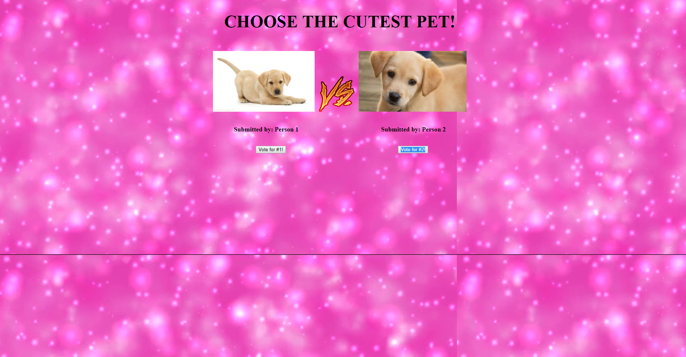
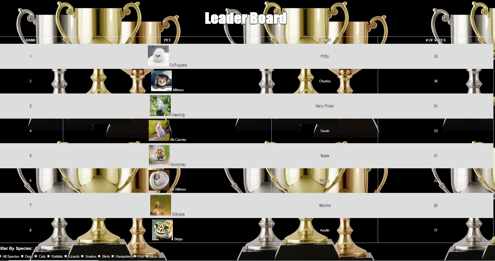
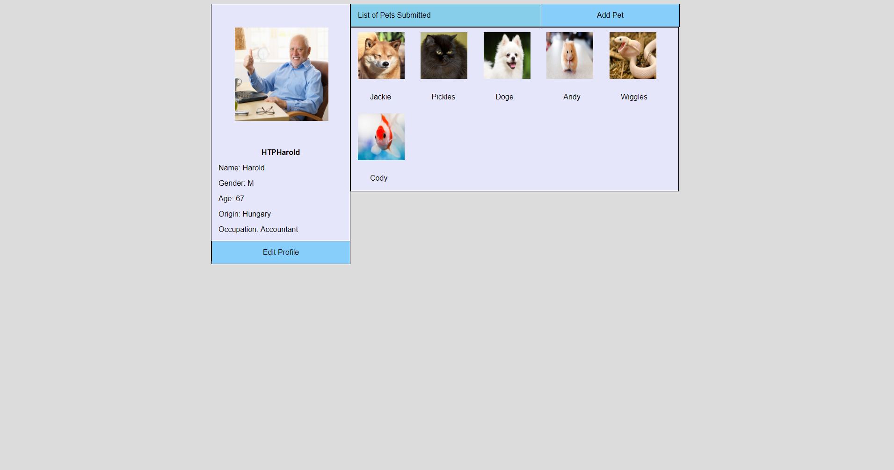

# TEAM NAME: BACK TO BASICS

# WEB APP NAME: PUPG (Working Title)

# Team Overview

* Joseph Capozzi, jcapozzi2
* Patrick Robb, PatrickRobb
* Brandon Loo, bloo-umass
* Jacob Grosner, JacobGros

# Innovative Idea

A website that allows users to upload picures of their own pets and allows them to vote on which pet they think is cuter. It uses a bracket system to keep the record and users can view he rankings of pets and filter by categories like size, gender, species, counry, etc. Users can log-in to the site so that it is not anonymous. There are some websites or applications that allow users to vote in a similar fashion but each has their differences. Most do not allow you to view the leaderboards and there are none about pets that we are aware of. Each user will upload a picutre of their pet and then fill out information about their pet. Each day there will be a daily voting system, one bracket per day until you have a winner. After a winner is picked, voting restarts from the beginning. A user can still submit during an ongoing voting cycle, but their pet will not be included in the competition until the next cycle starts. There is also a top-scoring leaderboard per day and a timer to keep track of the day and whether or not the user has voted that day yet.

# Important Data

Pet info: species, size, gender, likes

User: Username/Password, submited pets, previously liked pets

Top scorers: daily top pets

# User Interface

Provide a description and images of the user interface your
application will intend on supporting.

The user interface will feature a picture for each pet that was submitted by the user. They are used to represent that particular entity in the database and its rank on the rank page. 

