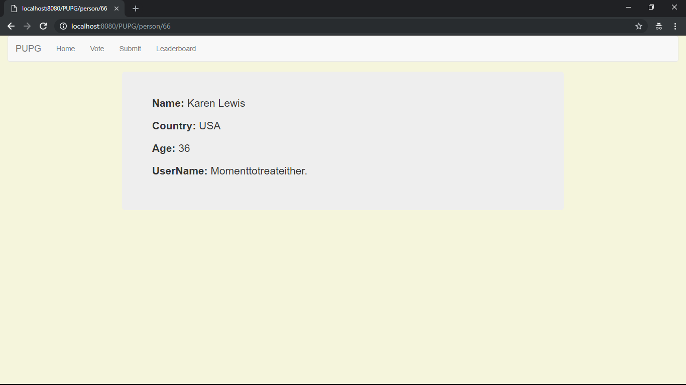

Overview:
Our application allows users to upload an image of their pets and vote on which one is the cutest as well as view the
leaderboards. Our project has changed since its conception in the following ways. We no longer plan to collect user votes in a seasonal bracket competition,
but currently, we want to allow users to vote once per day rather than resetting the vote counts after the season is over,  the vote counts
will not be reset. 

Team Members: 
Joseph Capozzi, Brandon Loo, Jacob Grosner, Patrick Robb

Video Link:https://www.youtube.com/watch?v=9h2GisyF6_I&feature=youtu.be
____________________________________________________________________

Design Overview:

Here is the final version of our database diagram that displays our two classes: Person and Pet, as well as their contents.

Here is the code for our models.py.  From here we create classes and varaibles for representing Person and Pet.
In addition, by using "models.ForeignKey" for the pet_owner varaible for Pet, we establlished a one-to-many relationship between the owner and Pet
where the owner is the primary key.  This was helpful for us as it made it easier for referencing within views.py.
Reverse url is also included for each class in order to provide a path to them within urls.py.

Here is the code for views.py.  Here we provide the functionality for rendering components of our website when a request is made to a specific page.
For instance with index, the code sorts through our database for pets and based on vote count, returns the highest voted pet (winner) to display for our home page.
In addition, we have stored html templates in a seperate folder so this code can display the page and necessary context.

Here is the code for urls.py.  Here we provide url mapping to our views so that our app can associate the request page with the corresponding view.

This is the home page for our app when you access the site.  At the top is a navigation bar as to provide a direct means of accessing the various components of our app.
Here we display the total number of registered pets and persons, as well as the current winner based on the pet with the most votes.
Additionally, the text for the name of pets and owners contains links that displays the detail page for the associated name.

Page that displays the details for a specific pet.

Page that displays the details for a specific person.

Voting page that displays two random pets for the user to vote on whichever one they like the most.

Page for submitting your own pet.

Page that displays a list for all the registered pets, ordering them based on their number of votes.
____________________________________________________________________

Problems/Successes:
There were some initial issues with running the server properly, using init.py, as well as using image fields.
In addition, there were issues with being able to consistently meet up due to conflicts with schedules.   
There have also been some minor technical issues occuring for our computers.

We have sucessfully set up a means of storing and populating a database for our project.  
We've also managed to set up and run a website that displays data from our generated database, 
as well as provide URL routing for traversing different pages of our app.
